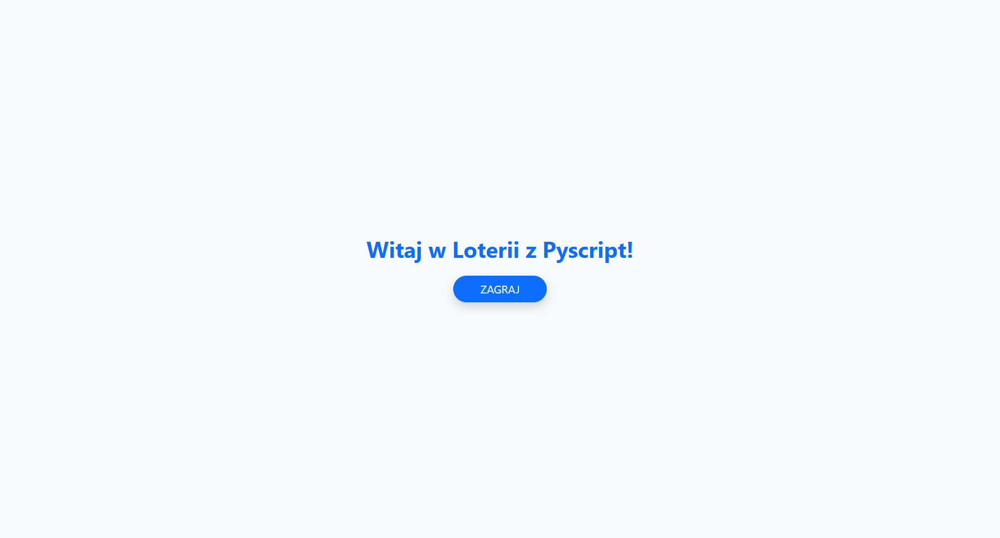

# 🎲 PyScript Lottery App

Edukacyjna aplikacja loteryjna stworzona w HTML + Python z wykorzystaniem **PyScript** oraz **Bootstrap 5**. Projekt ma na celu naukę podstaw programowania, klas, oraz interakcji z interfejsem webowym bez użycia JavaScript.

---

## 📘 Opis

Ta aplikacja umożliwia użytkownikowi:
- Wpisanie 6 szczęśliwych liczb
- Losowanie liczb w zakresie 1–49
- Animację losowania i ocenę trafień

Została zbudowana wyłącznie z HTML, CSS i Python (przez PyScript), co czyni ją idealnym przykładem edukacyjnej aplikacji webowej bez potrzeby korzystania z backendu czy bibliotek JS.

---

## 🚀 Funkcje

- ✅ Dynamiczne przełączanie ekranów (start → wybór → wynik)
- ✅ Obsługa klas Pythona do zarządzania ekranami i logiką
- ✅ Użycie Bootstrapa do responsywnego i estetycznego interfejsu
- ✅ Działa całkowicie lokalnie (nie wymaga instalacji Pythona)

---

## 🧪 Demo

[**Live Demo**](https://kacper-korzen.github.io/pyscript/) 

---

## 📸 Zrzuty ekranu

---

## Licencja

Ten projekt jest dostępny na licencji MIT. Szczegóły można znaleźć na stronie [`LICENSE`](https://choosealicense.com/licenses/mit/).

---

## Autorzy

- [@Kacper K](https://www.github.com/kacper-korzen)